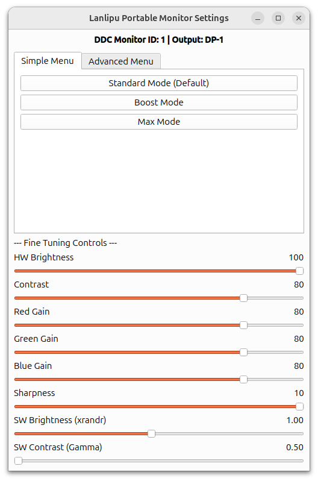
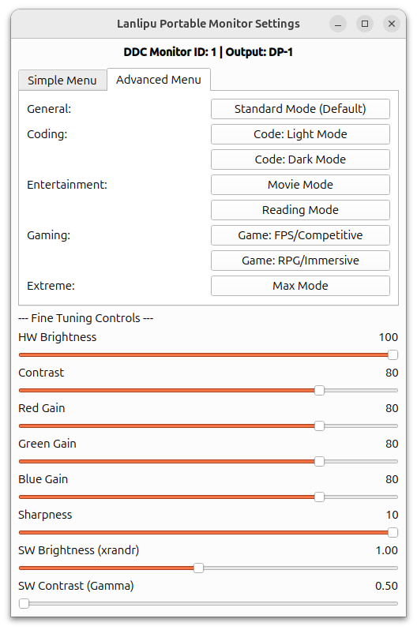

# Lanlipu Portable Monitor Brightness Setting

สคริปต์ Bash สำหรับตั้งค่าความสว่าง ความคมชัด และสีของพอร์ทเทเบิลมอนิเตอร์ RTK (RealTek) 6432 โดยใช้เครื่องมือ `ddcutil` และ `xrandr` เพื่อควบคุมทั้งฮาร์ดแวร์และซอฟต์แวร์

## ข้อกำหนดเบื้องต้น

- ระบบปฏิบัติการ Linux ที่รองรับ `ddcutil` และ `xrandr`
- ติดตั้ง `ddcutil` (สามารถติดตั้งได้ด้วย `sudo apt install ddcutil` บน Ubuntu/Debian)
- หรือติดตั้งอัตโนมัติ `ddcutil` (สคริปต์ portable_monitor_setting.sh จะพยายามติดตั้งให้หากไม่มี บน Ubuntu/Debian)
- สิทธิ์ sudo สำหรับรันคำสั่ง `ddcutil`
- พอร์ทเทเบิลมอนิเตอร์ RTK 6432 เชื่อมต่อและตรวจจับได้
- ติดตั้ง `uv` (จำเป็นสำหรับใช้งาน GUI) ติดตั้งด้วยคำสั่ง:
  ```bash
  curl -LsSf https://astral.sh/uv/install.sh | sh
  ```

## การติดตั้ง

1. โคลน repository นี้ไปยังเครื่องของคุณ:
   ```
   git clone https://github.com/pbseiya/Lanlipu-Portable-Monitor-Brightness-Setting.git
   cd lanlipu_portable_monitor_brightness_setting
   ```

2. ทำให้ไฟล์สคริปต์เป็นไฟล์ที่รันได้:
   ```
   chmod +x cli/portable_monitor_setting.sh
   ```

## การตั้งค่า (Configuration)

เพื่อใช้งาน GUI โดยไม่ต้องกรอกรหัสผ่าน sudo ทุกครั้ง ให้สร้างไฟล์ `.env` ในโฟลเดอร์ `gui`:
1. คัดลอกไฟล์ตัวอย่าง:
   ```bash
   cp gui/.env.example gui/.env
   ```
2. แก้ไขไฟล์ `gui/.env` และใส่รหัสผ่าน sudo ของคุณ:
   ```env
   SUDO_PASSWORD=รหัสผ่านของคุณ
   ```

## การใช้งาน

### CLI (Command Line)
รันสคริปต์โดยใช้คำสั่ง:
```
./cli/portable_monitor_setting.sh
```

สคริปต์จะ:
- ตรวจจับพอร์ทเทเบิลมอนิเตอร์ RTK 6432 อัตโนมัติ
- แสดงเมนูให้เลือกประเภทเมนู (Simple หรือ Advanced)
- ใช้การตั้งค่าที่เหมาะสมตามโหมดที่เลือก

### GUI (Original Interface) - Experimental
เข้าไปที่โฟลเดอร์ `gui` และรันด้วย `uv`:
```
cd gui
uv run main.py
```
> **หมายเหตุ**: เมื่อใช้คำสั่ง `uv run` ระบบจะทำการดาวน์โหลดและติดตั้ง dependencies ที่จำเป็นให้โดยอัตโนมัติในครั้งแรก

**ความสามารถของ GUI:**
- **เลือกโหมดง่ายๆ (Preset Tabs):** แบ่งหมวดหมู่เป็น Simple และ Advanced ให้เลือกกดได้ทันที
- **ปรับแต่งละเอียด (Sliders):** เลื่อนปรับค่า Brightness, Contrast, RGB ได้เองตามต้องการ
- **ปรับความสว่างซอฟต์แวร์ (Gamma):** ช่วยลดแสงให้มืดกว่าปกติ (สำหรับอ่าน eBook) หรือเร่งให้สว่างกว่าปกติได้ด้วย `xrandr`

**ตัวอย่างหน้าจอ:**

| Simple Menu | Advanced Menu |
| :---: | :---: |
|  |  |


### คำอธิบายตัวปรับแต่งละเอียด (Fine Tuning Controls)

- **HW Brightness**: ปรับความสว่างของหลอดไฟจอภาพ (Hardware VCP 10)
- **HW Contrast**: ปรับความเปรียบต่างของแสงและเงา (Hardware VCP 12)
- **HW Red/Green/Blue Gain**: ปรับค่าสีแดง เขียว น้ำเงิน (อุณหภูมิสี Hardware)
- **HW Sharpness**: ปรับความคมชัดของภาพและตัวอักษร (Hardware VCP 87)
- **SW Brightness (xrandr)**: ปรับความสว่างด้วยซอฟต์แวร์ เหมาะสำหรับลดแสงต่ำกว่าขีดจำกัดฮาร์ดแวร์ (เช่น อ่านหนังสือตอนกลางคืน) หรือเร่งแสง
- **SW Contrast (Gamma)**: ปรับค่า Gamma (Contrast แบบซอฟต์แวร์) ค่ามาตรฐานคือ 1.00

### เมนูหลัก

- **Simple Menu**: มี 3 โหมดพื้นฐานสำหรับผู้ใช้ทั่วไป
- **Advanced Menu**: มี 8 โหมดสำหรับงานเฉพาะ เช่น การเขียนโค้ด ความบันเทิง การเล่นเกม

### โหมดต่างๆ

#### Simple Menu
1. **Standard Mode**: ค่าเริ่มต้นจากโรงงาน (Preset 0x05, Contrast 50, RGB 50/50/50, Brightness 100, Software Brightness 1.0)
2. **Boost Mode**: ความสว่างสูงและความคมชัด (Preset 0x08, Contrast 75, RGB 80/80/80, Brightness 100, Software Brightness 1.0)
3. **Max Mode**: สูงสุดฮาร์ดแวร์ + ซอฟต์แวร์ (Preset 0x08, Contrast 100, RGB 80/80/80, Brightness 100, Software Brightness 1.2)

#### Advanced Menu
1. **Standard Mode**: ค่าเริ่มต้นจากโรงงาน
2. **Code: Light Mode**: เหมาะสำหรับการเขียนโค้ดในสภาพแสงสว่าง (Preset 0x05, Contrast 75, RGB 50/50/50, Brightness 100, Software Brightness 1.0)
3. **Code: Dark Mode**: เหมาะสำหรับการเขียนโค้ดในสภาพแสงมืด เพื่อลดความเมื่อยล้าของสายตา (Preset 0x05, Contrast 60, RGB 50/50/50, Brightness 40, Software Brightness 1.0)
4. **Movie Mode**: เหมาะสำหรับดูหนัง อบอุ่นและภาพยนตร์ (Preset 0x04, Contrast 80, RGB 50/50/50, Brightness 90, Software Brightness 1.0)
5. **Reading Mode**: เหมาะสำหรับอ่านเว็บหรือ e-book (Preset 0x04, Contrast 45, RGB 50/50/50, Brightness 35, Software Brightness 0.9)
6. **Game: FPS/Competitive**: เหมาะสำหรับเกม FPS ที่ต้องการการมองเห็นสูงสุด (Preset 0x08, Contrast 85, RGB 80/80/80, Brightness 100, Software Brightness 1.0)
7. **Game: RPG/Immersive**: เหมาะสำหรับเกม RPG ที่ต้องการสีสันสดใส (Preset 0x02, Contrast 80, RGB 50/50/50, Brightness 95, Software Brightness 1.0)
8. **Max Mode**: โหมดสูงสุด (Preset 0x08, Contrast 100, RGB 80/80/80, Brightness 100, Software Brightness 1.2)

## สคริปต์เสริม (Utility Scripts)

### `extract_edid.py`
สคริปต์ Python นี้ใช้สำหรับตรวจสอบและดึงข้อมูลดิบ (Raw EDID) จาก output ของ `ddcutil`.
- **จำเป็นต้องใช้เมื่อไหร่**: จอพกพาบางรุ่น (เช่น RTK ตัวนี้) อาจจะไม่ยอมส่งค่า EDID ผ่านเครื่องมือปกติ
- **มันทำอะไร**: สคริปต์นี้จะไปแกะรหัส Hex จากคำสั่ง `ddcutil detect --verbose` ออกมา เพื่อให้เรานำไปถอดรหัส (Decode) ดูสเปกเชิงลึกได้ (เช่น ค่าความสว่าง Nits, HDR)

## การแก้ปัญหา

- **ไม่พบมอนิเตอร์**: ตรวจสอบว่ามอนิเตอร์เชื่อมต่ออย่างถูกต้องและ `ddcutil detect` สามารถตรวจจับได้ หากไม่พบ สคริปต์จะถามให้ force try บน Display 1
- **สิทธิ์ไม่เพียงพอ**: ตรวจสอบว่าคุณมีสิทธิ์ sudo และ `ddcutil` ติดตั้งอย่างถูกต้อง
- **ไม่ทำงาน**: ตรวจสอบว่า output ของ xrandr เป็น DP-1 (สามารถแก้ไขในสคริปต์ได้ถ้าจำเป็น)

## ใบอนุญาต

โปรเจกต์นี้ใช้ใบอนุญาต MIT